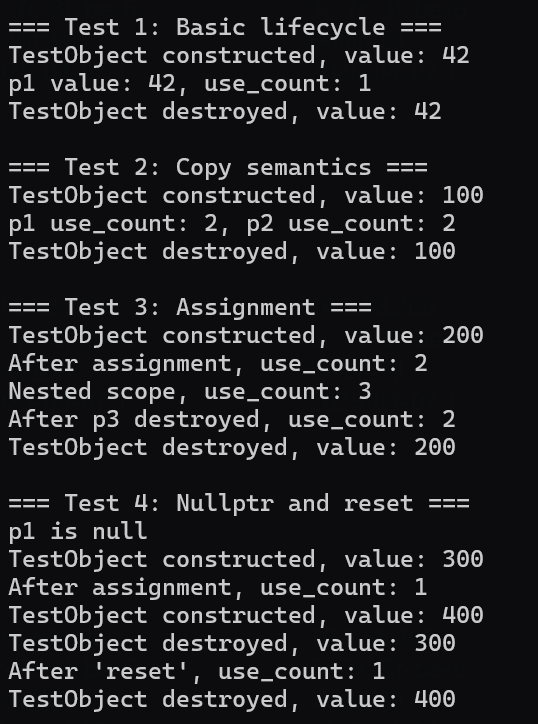

```
#include <iostream>

template <typename T>
class SharedPtr {
public:
	// 默认构造函数（空指针）
	SharedPtr() : ptr_(nullptr), ref_count_(nullptr) {}

	// 构造函数（托管裸指针）
	// std::shared_ptr<int> p = new int(42);  // 错误：explicit禁止隐式转换
	// std::shared_ptr<int> p(new int(42));   // 正确：显式构造
	explicit SharedPtr(T* ptr) : ptr_(ptr), ref_count_(new int(1)) {}

	// 拷贝构造函数
	SharedPtr(const SharedPtr& other) : ptr_(other.ptr_), ref_count_(other.ref_count_) {
		if (ref_count_) (*ref_count_)++;
	}

	// 拷贝赋值运算符
	SharedPtr& operator=(const SharedPtr& other) {
		if (this != &other) {
			release();  // 释放当前资源
			ptr_ = other.ptr_;
			ref_count_ = other.ref_count_;
			if (ref_count_) (*ref_count_)++;
		}
		return *this;
	}

	// 析构函数
	~SharedPtr() {
		release();
	}

	// 解引用操作符
	T& operator*() const { return *ptr_; }
	// C++ 规定：operator->() 必须返回一个原始指针（或另一个重载了->的对象），编译器会递归调用->直到获得原始指针
	T* operator->() const { return ptr_; }

	// 获取裸指针
	T* get() const { return ptr_; }

	// 获取引用计数
	int use_count() const { return ref_count_ ? *ref_count_ : 0; }

private:
	T* ptr_;          // 托管的裸指针
	// 引用计数必须动态分配（即使用指针），原因如下：
	// 多个 SharedPtr 对象可能指向同一个资源（例如通过拷贝构造或赋值），它们需要共享同一个引用计数。
	// 如果 ref_count_ 是普通 int 成员变量（而非指针），每个 SharedPtr 对象会有独立的 ref_count_ 副本，无法实现共享。
	int* ref_count_;   // 引用计数（动态分配）

	// 释放资源
	void release() {
		if (ref_count_) {
			(*ref_count_)--;
			if (*ref_count_ == 0) {
				delete ptr_;
				delete ref_count_;
				ptr_ = nullptr;
				ref_count_ = nullptr;
			}
		}
	}
};

// 自定义测试类，析构时打印日志
class TestObject {
public:
	TestObject(int val) : value(val) {
		std::cout << "TestObject constructed, value: " << value << std::endl;
	}
	~TestObject() {
		std::cout << "TestObject destroyed, value: " << value << std::endl;
	}
	int value;
};

int main() {
	// 测试1：基础构造和析构
	{
		std::cout << "\n=== Test 1: Basic lifecycle ===" << std::endl;
		SharedPtr<TestObject> p1(new TestObject(42));
		std::cout << "p1 value: " << p1->value << ", use_count: " << p1.use_count() << std::endl;
	} // p1 析构，资源释放

	// 测试2：拷贝构造和引用计数
	{
		std::cout << "\n=== Test 2: Copy semantics ===" << std::endl;
		SharedPtr<TestObject> p1(new TestObject(100));
		SharedPtr<TestObject> p2 = p1; // 拷贝构造
		std::cout << "p1 use_count: " << p1.use_count() << ", p2 use_count: " << p2.use_count() << std::endl;
	} // p1 和 p2 析构，资源释放

	// 测试3：赋值操作和引用计数
	{
		std::cout << "\n=== Test 3: Assignment ===" << std::endl;
		SharedPtr<TestObject> p1(new TestObject(200));
		SharedPtr<TestObject> p2;
		p2 = p1; // 拷贝赋值
		std::cout << "After assignment, use_count: " << p1.use_count() << std::endl;

		{
			SharedPtr<TestObject> p3 = p1;
			std::cout << "Nested scope, use_count: " << p1.use_count() << std::endl;
		} // p3 析构，引用计数减1

		std::cout << "After p3 destroyed, use_count: " << p1.use_count() << std::endl;
	} // p1 和 p2 析构

	// 测试4：空指针和手动释放
	{
		std::cout << "\n=== Test 4: Nullptr and reset ===" << std::endl;
		SharedPtr<TestObject> p1; // 默认构造
		std::cout << "p1 is " << (p1.get() ? "not null" : "null") << std::endl;

		p1 = SharedPtr<TestObject>(new TestObject(300)); // 临时对象赋值
		std::cout << "After assignment, use_count: " << p1.use_count() << std::endl;

		// 模拟 reset()：赋值为新对象
		p1 = SharedPtr<TestObject>(new TestObject(400));
		std::cout << "After 'reset', use_count: " << p1.use_count() << std::endl;
	} // p1 析构

	return 0;
}
```

